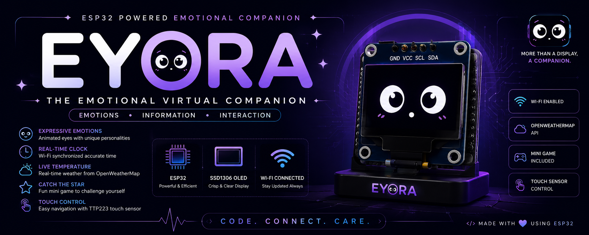
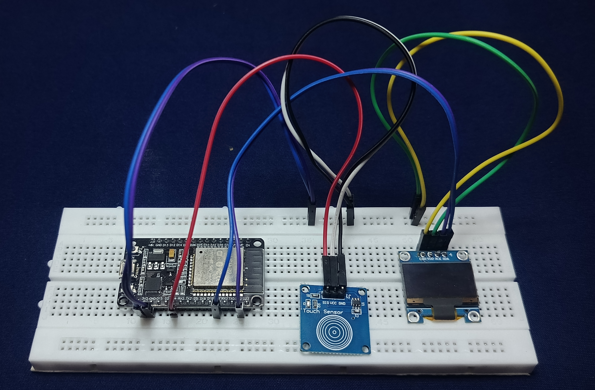
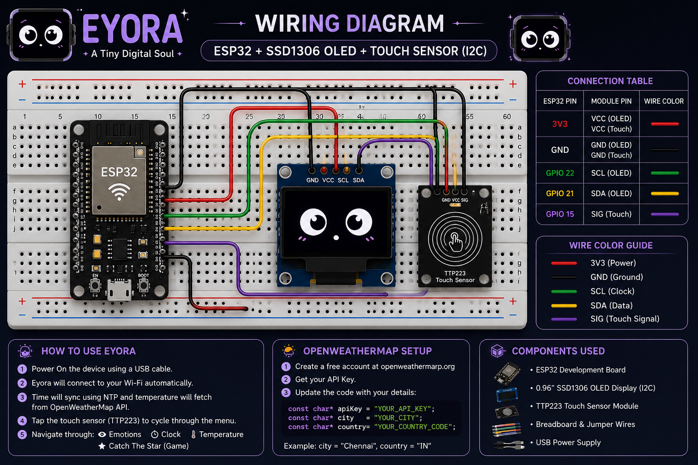
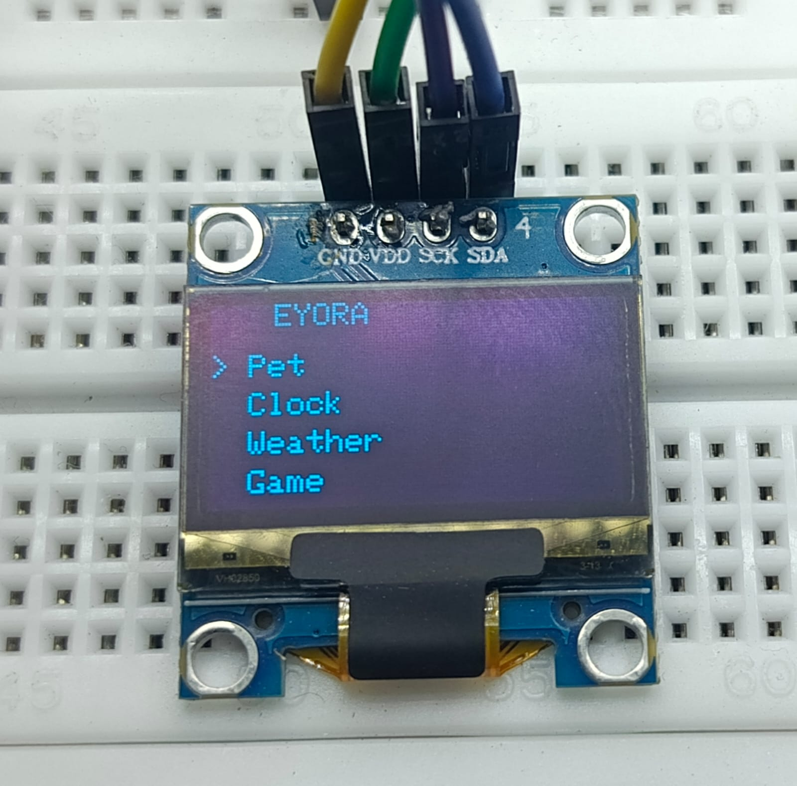
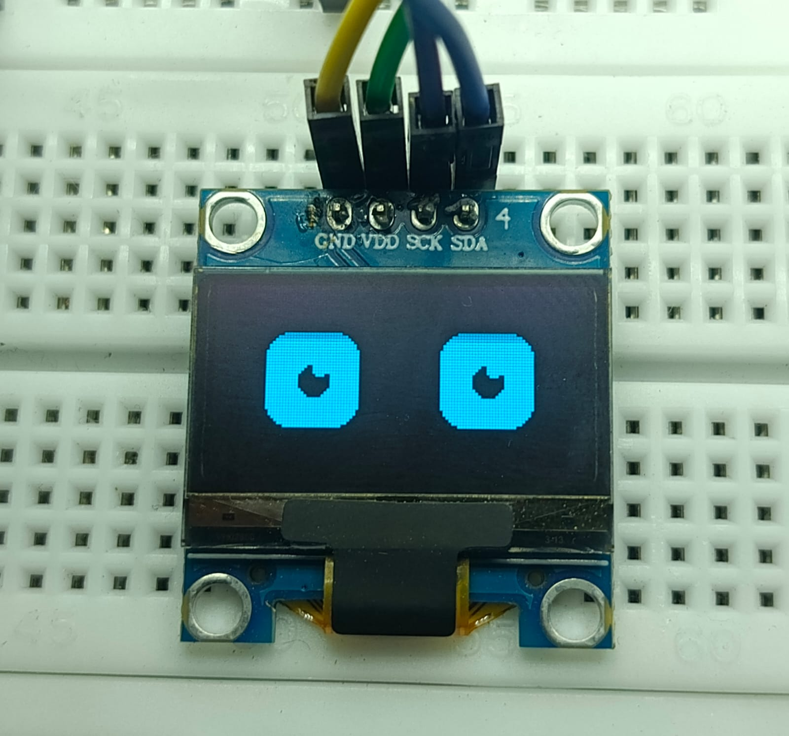
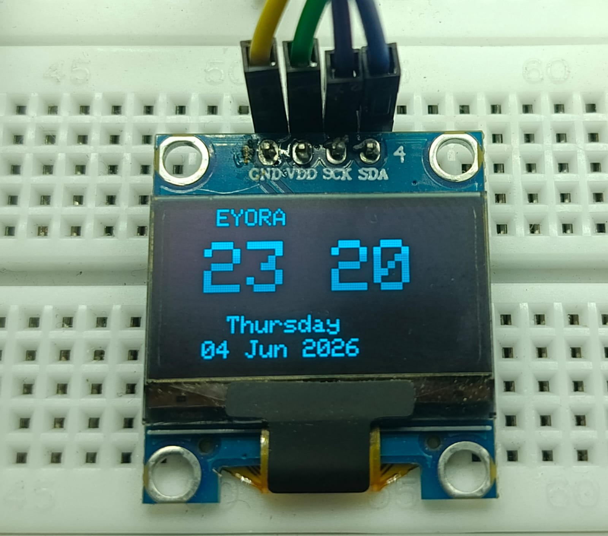
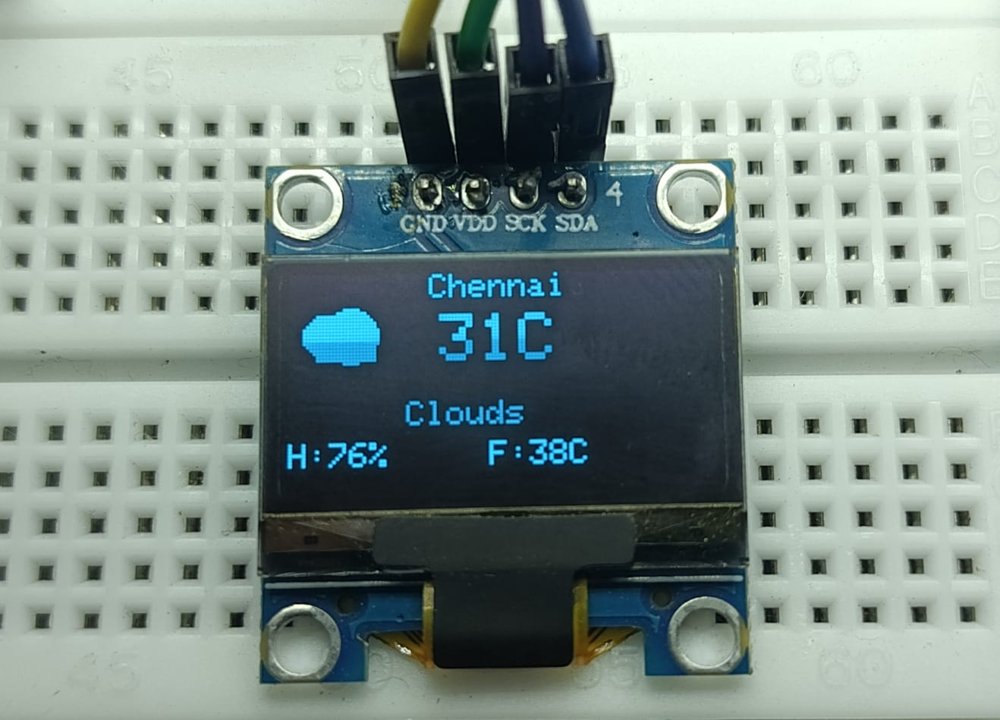
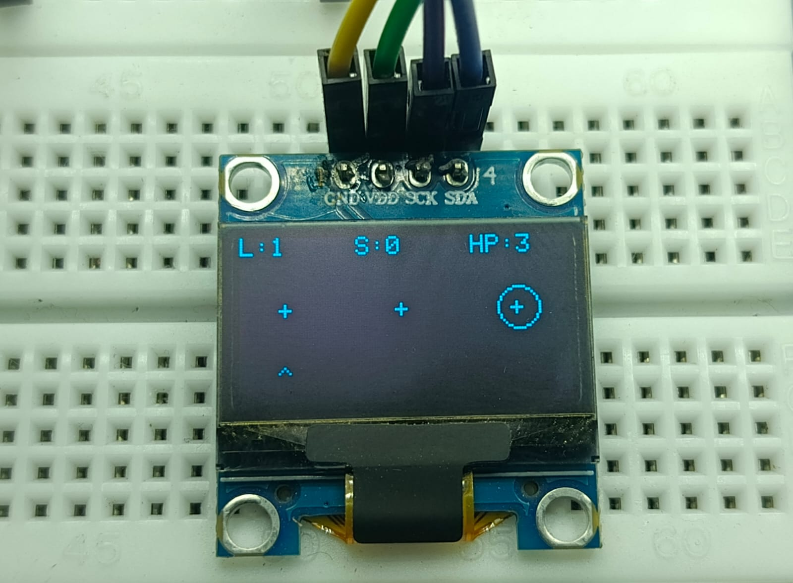

<div align="center">



# 👁️ Eyora

### The Emotional Virtual Companion

An ESP32-powered digital companion that expresses emotions, displays real-time information, and brings personality to a tiny OLED screen.


</div>

---

# 📸 Project Preview

## 🏗️ Final Build

<div align="center">



</div>

---

## 🔌 Wiring Diagram

<div align="center">



</div>

---

## 🖥️ Screenshots

<div align="center">







</div>

---

# ✨ About Eyora

Eyora is an ESP32-powered emotional virtual companion designed to transform a simple OLED display into a living digital personality.

Built around the SSD1306 OLED display, Eyora combines expressive eye animations, real-time clock synchronization, live weather updates, touch interaction, and mini-games into a compact embedded system.

Rather than acting as a simple display, Eyora creates the illusion of a digital companion through animations, reactions, and smooth emotional transitions.

---

# ⚡ Features

- 👁️ Dynamic Eye Emotions
- 🕒 Real-Time Wi-Fi Clock
- 🌡️ Live Temperature Monitoring
- ⭐ Catch The Star Mini Game
- 🖐️ Touch Sensor Navigation
- 📶 Wi-Fi Connectivity
- 🎨 Smooth OLED Animations
- ☁️ OpenWeatherMap Integration
- ⏰ NTP Time Synchronization

---

# 🎭 Emotion Engine

Eyora supports multiple emotional states:

```text
[0] Happy
[1] Curious
[2] Excited
[3] Sleepy
[4] Wink
[5] Angry
[6] Shocked
[7] Thinking
[8] Deep Sleep
```

Each emotion includes custom eye movements, blinking patterns, and smooth transitions to create a more lifelike experience.

---

# 🕒 Clock Module

```cpp
Source     : NTP Server
Connection : Wi-Fi
Update     : Automatic
RTC Module : Not Required
```

### Features

- Automatic time synchronization
- Internet-based accuracy
- Real-time clock display
- No external RTC module required

---

# 🌡️ Weather Module

```cpp
Provider : OpenWeatherMap API
Protocol : HTTP
Format   : JSON
Output   : Current Temperature
```

### Data Flow

```text
ESP32
 │
 ▼
Wi-Fi
 │
 ▼
OpenWeatherMap API
 │
 ▼
Temperature Data
 │
 ▼
OLED Display
```

### Features

- Live temperature updates
- Automatic refresh
- Wi-Fi weather synchronization
- Lightweight API integration
- Real-time environmental information

---

# ⭐ Catch The Star

A lightweight mini-game built directly into Eyora.

```text
Objective
│
├── Catch Stars
├── Increase Score
├── Level Up
└── Beat High Score
```

### Features

- Score Tracking
- Level Progression
- Responsive Controls
- OLED Optimized Graphics
- Replay Support

---

# 📱 Menu Structure

```text
Eyora
│
├── 👁️ Emotions
├── 🕒 Clock
├── 🌡️ Temperature
└── ⭐ Catch The Star
```

---

# 🖐️ Touch Controls

Eyora uses a TTP223 Capacitive Touch Sensor for navigation.

```text
Single Touch
      │
      ▼
Navigate Menu

Touch Again
      │
      ▼
Select Option
```

---

# ⚙️ Hardware

| Component | Purpose |
|------------|------------|
| ESP32 Development Board | Main Controller |
| SSD1306 OLED Display | User Interface |
| TTP223 Touch Sensor | User Input |
| Breadboard | Circuit Assembly |
| Jumper Wires | Connections |
| USB Cable | Power Supply |

---

# 🔌 Wiring Connections

## OLED Display

| OLED Pin | ESP32 Pin |
|-----------|-----------|
| VCC | 3V3 |
| GND | GND |
| SDA | GPIO 21 |
| SCL | GPIO 22 |

---

## Touch Sensor

| TTP223 Pin | ESP32 Pin |
|------------|------------|
| VCC | 3V3 |
| GND | GND |
| SIG | GPIO 04 |

---

## Complete Wiring Table

| ESP32 Pin | Connected To |
|------------|--------------|
| 3V3 | OLED VCC |
| 3V3 | TTP223 VCC |
| GND | OLED GND |
| GND | TTP223 GND |
| GPIO 21 | OLED SDA |
| GPIO 22 | OLED SCL |
| GPIO 04 | TTP223 SIG |

---

# 🛠️ Software Stack

### Development Environment

```text
Arduino IDE
```

### Libraries

```text
Adafruit SSD1306
Adafruit GFX
WiFi
HTTPClient
ArduinoJson
NTPClient
WiFiUdp
```

### Online Services

```text
NTP Time Servers
OpenWeatherMap API
```

---

# 🌐 Wi-Fi Configuration

```cpp
const char* ssid     = "YOUR_WIFI_NAME";
const char* password = "YOUR_WIFI_PASSWORD";
```

---

# ☁️ OpenWeatherMap Configuration

Create a free account on:

https://openweathermap.org/api

Configure your API settings:

```cpp
String apiKey      = "YOUR_API_KEY";
String city        = "YOUR_CITY";
String countryCode = "YOUR_COUNTRY_CODE";
```

### Example

```cpp
String city        = "Chennai";
String countryCode = "IN";
```

---

# 🚀 Installation

## Clone Repository

```bash
git clone https://github.com/undefinedDeveloper-404/eyora.git
```

## Install Required Libraries

```text
Adafruit SSD1306
Adafruit GFX
ArduinoJson
NTPClient
WiFiUdp
```

## Upload Firmware

```text
Install ESP32 Package
          │
          ▼
Install Libraries
          │
          ▼
Configure Wi-Fi
          │
          ▼
Configure API Key
          │
          ▼
Compile Project
          │
          ▼
Upload Firmware
          │
          ▼
Power On Eyora
```

---

# 🖥️ Runtime Flow

```text
Boot
 │
 ▼
Initialize OLED
 │
 ▼
Connect Wi-Fi
 │
 ▼
Sync Time
 │
 ▼
Fetch Weather
 │
 ▼
Load Menu
 │
 ▼
User Interaction
```

---

# 📊 Specifications

```text
MCU          : ESP32
Display      : SSD1306 OLED
Input        : TTP223 Touch Sensor
Connectivity : Wi-Fi
Clock Source : NTP
Weather API  : OpenWeatherMap
Language     : C++
IDE          : Arduino IDE
```

---

# 🎯 Project Goal

```text
Create a compact emotional virtual companion
that combines personality, real-time information,
and entertainment using ESP32 hardware.
```

---

# 🙏 Inspiration

Eyora is inspired by emotional virtual companions and digital pets while introducing its own identity through custom animations, Wi-Fi-powered features, real-time information systems, and interactive gameplay.

The project explores how embedded systems can create engaging emotional experiences using minimal hardware.

---

<div align="center">

# 👁️✨

### Eyora — The Emotional Virtual Companion

More Than a Display. A Companion With Emotions.

Made with ❤️ using ESP32 and OLED Technology.

</div>
